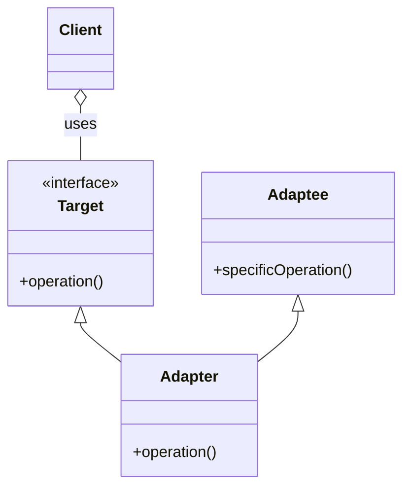

# Adapter Pattern

Na pasta **before** temos um código que precisa ler um arquivo json que contêm informações sobre como rodar um experimento.

Por algum motivo precisamos ler essa configuração também no formato XML.

Na pasta *partial_adpter* criamos o adpatador XMLConfigAdpter.

Para lidar com o XML seria interessante usar um lib de terceiros (beautifulsoup por ex.). Podemos criar um adaptador que permita ler as configs do XML.

Ler as configs não deveria depender do formato do arquivo, seja ele um json, ou XML, ou ainda quem sabe de um HTML, a intenção sempre será *get* uma determinada configuração.

Portanto, podemos abstrair essa ideia e dizer que todo adaptador de leitura do arquivo de config sempre terá um método do tipo "get".

